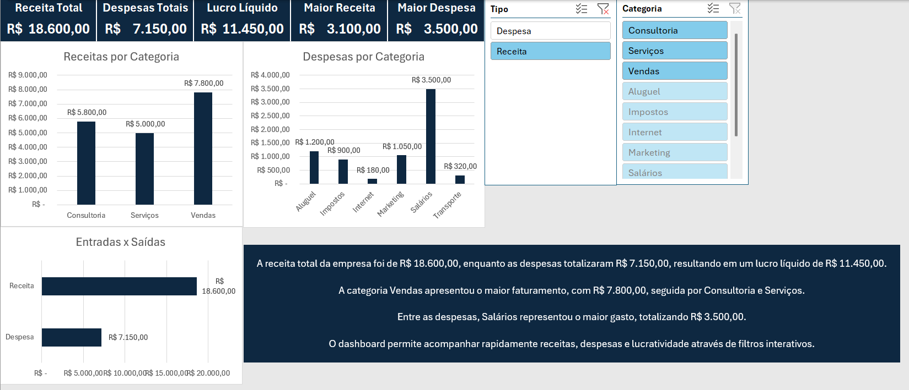

# Dashboard Financeiro no Excel

Este projeto apresenta um dashboard financeiro desenvolvido no Microsoft Excel para acompanhamento de receitas, despesas, lucro e indicadores financeiros.

## Objetivo

Transformar dados financeiros em informações visuais para facilitar o acompanhamento dos resultados da empresa.

## Dashboard

## Indicadores apresentados

- Receita Total
- Despesas Totais
- Lucro Líquido
- Maior Receita
- Maior Despesa

## Análises realizadas

- Receitas por Categoria
- Despesas por Categoria
- Entradas x Saídas
- Identificação das principais fontes de receita
- Identificação dos maiores custos

## Ferramentas utilizadas

- Microsoft Excel
- Tabelas Dinâmicas
- Segmentação de Dados
- SOMASE
- Fórmulas Financeiras
- Dashboard Executivo

## Conclusão

A receita total foi de R$ 18.600,00 e as despesas totalizaram R$ 7.150,00, resultando em um lucro líquido de R$ 11.450,00.

A categoria Vendas apresentou o maior faturamento, enquanto Salários representou o maior custo da operação.

O dashboard permite acompanhar rapidamente a saúde financeira da empresa através de filtros interativos.

## Arquivo do projeto

`dashboard-financeiro.xlsx`
